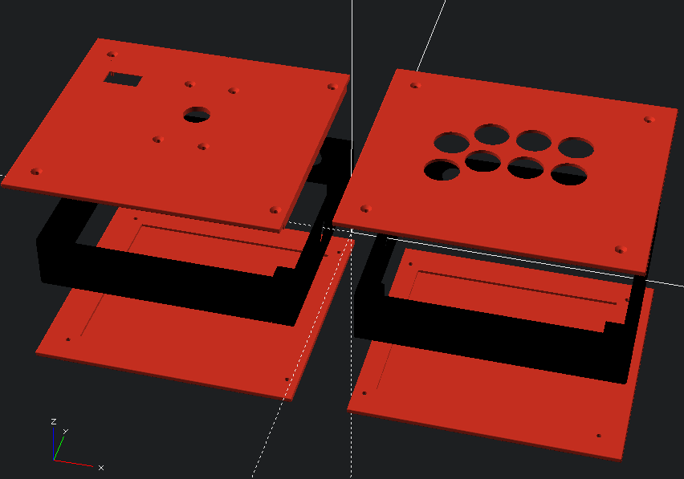
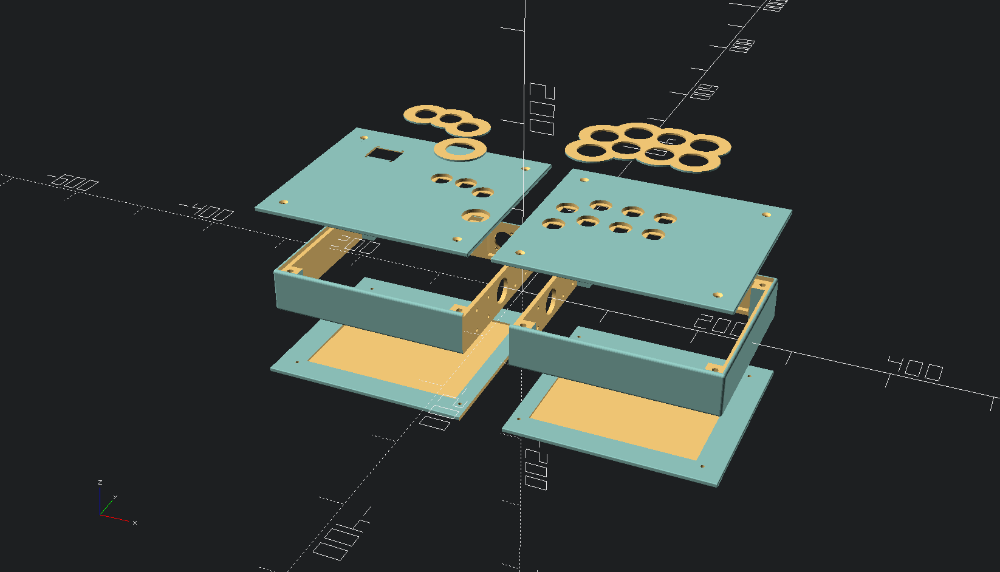
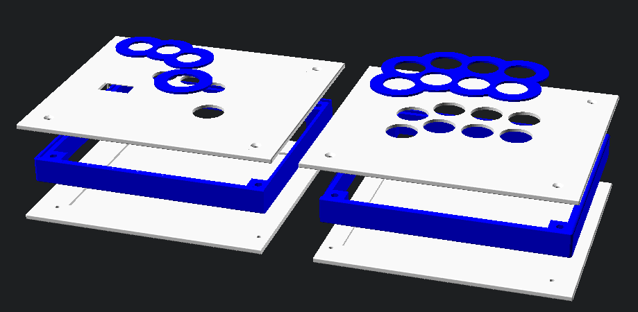

# The Buildable Stick System ("oled+" fork)

Files for 3D printing an arcade stick.

**\[[GALLERY](README.md#gallery) AT THE BOTTOM]**

Originally an attempt to make a couple customized STL files for the [OpenStickCommunity Fightstick
Case](https://github.com/OpenStickCommunity/Hardware/tree/main/Fightstick%20Case), the changes ballooned to fit my
design and became incompatible with that project's components. This should be considered a different project with some
similar DNA, but to stress again, it could not have been done without that project as a guide star. See **Attribution**.

_Now with this fork my changes balooned a bit too, and from wanting to just have an oled window on bss' very cool system, now I'm working to add a standard hitbox layout_
_(which was strangely missing in my opinion), an oled window in almost every useful place, and a somewhat big change that I don't know when I, He or someone else, will do it, see [TODO.md](TODO.md)._

## Designing

No particular arcade stick design is prescribed by this project, instead, SCAD files are provided to choose desired
component objects or create new ones. The [OpenSCAD](https://openscad.org/index.html) language is essentially a functional programming language, making it
it easy to reuse, alter, and compose objects. If you do not see the object you would like, you can likely create it by
starting with an existing object and constructing what you'd like with new or existing components.

## Printing

These items all fit on a 256mm^2 print bed; I use a Bambu Lab P1P based on what I've learned from the
OpenStickCommunity. Standard settings seem sufficiently sturdy for my purposes, though the slicer has done a couple
weird things, in my experience.

## Assembling

What you'll need beyond these objects:

* An arcade stick board (I recommend [TheTrain's RP2040 Advanced Breakout
  Board](https://github.com/OpenStickCommunity/Hardware/tree/main/RP2040%20Advanced%20Breakout%20Board))
    * 4 M3 8mm hex bolts to secure the PCB to a panel
* Per frame and plate combo:
    * 4 45mm M4 hex brass standoffs
    * 8 12-16mm M4 countersunk hex bolts
* Per frame connection point:
    * 8 16mm M4 bolts
    * 8 M4 flange nuts
* For a lever:
    * 4 12-16mm M4 countersunk hex bolts
    * 4 M4 flange nuts
* For Neutrik D connections:
    * 2 10mm M3 hex bolts
    * 2 M3 flange nuts
* Buttons and levers as desired
* Wiring as required

## Rough Costs

This is a rough estimate of the cost to produce one of these sticks, assuming a usual 2-frame design and layout.
Filament masses from Bambu Studio estimates, using Bambu PLA Basic.

* Left and right frame: **$7.08 USD** (141.84g each, as of 2023-09-12)
* Left and right top panels: **~$6.74 USD** (~135g each, as of 2023-09-12)
* Left and right bottom panels: **$5.90 USD** (118.16g each, as of 2023-09-12)
* Miscellaneous mounting plates, decorative plates, etc.: **~$1.00 USD** (~40g, as of 2023-09-12)
* 8 16mm M4 bolts to connect the frames: **$0.72 USD** (you can get a pack of 100 on Amazon for $9, as of 2023-09-12)
* 8 M4 flange nuts to connect the frames: **$0.68 USD** (you can get a pack of 100 on Amazon for $8.50, as of 2023-09-12)
* 4 10mm M3 bolts to connect Neutrik D plates to frames: **$0.40 USD** (you can get a pack of 100 on Amazon for $10, as
  of 2023-09-12)
* 4 M3 flange nuts to connect Neutrik D plates to frames: **$0.34 USD** (you can get a pack of 100 on Amazon for $8.50,
  as of 2023-09-12)
* 8 45mm M4 spacers to connect panels to frames: **$2.40 USD** (you can get a pack of 10 on AliExpress for $3, as of
  2023-09-12)
    * You could 3D print these too, but you're probably better off with brass ones as they give some weight to the
      stick anyway
* 8 16mm M4 bolts to connect top plates to frames: **$0.72 USD** (you can get a pack of 100 on Amazon for $9, as of
* 8 12mm M4 bolts to connect bottom plates to frames: **$0.72 USD** (you can get a pack of 100 on Amazon for $9, as of
  2023-09-12)
    * You may be tempted to use 16mm M4 bolts for both the top and bottom, but the spacers I have aren't threaded all
      the way through the shaft, and 16mm bolts won't make it all the way on the bottom panel, but do on the top panel
      (which is 5mm thicker); be careful I guess

With an enclosure coming in around $26, depending on your choices --- say, ~$30 for TheTrain's RP2040 Advanced Breakout
Board, ~$60 for Sanwa buttons and a lever, and ~$20 for miscellaneous connectors and wiring --- you can put a
full-featured controller with an open source foundation together for around $135.

## Miscellany

See the [docs](docs/) directory for more thoughts too scattered for this document.

## Issues and Limitations

This is a living repository, and as such, there are likely issues with the objects, known or otherwise.
These issues may be fixed in the future; see [TODO.md](TODO.md) for details.

## Development and Contributing

Improvements, variants, new layouts, novel ideas, and etc. are all welcome.

These files are suitable for previewing and rendering in OpenSCAD. They may also work in FreeCAD and perhaps other
software, but they are developed in OpenSCAD, so YMMV otherwise.

## Attribution

Inspired by the incredible work of [TheTrain](https://github.com/TheTrainGoes) on the [OpenStickCommunity Fightstick
Case](https://github.com/OpenStickCommunity/Hardware/tree/main/Fightstick%20Case), itself based on the incredible work
by [Dash n'Mash](https://twitter.com/Dash_xx_Mash?s=20). Original work Copyright 2023 TheTrain, [licensed under CC BY
4.0](https://creativecommons.org/licenses/by/4.0/).

Made possible by the amazing efforts of [slagcoin](https://www.slagcoin.com/).

## Author and Licensing

**Written by and copyright Brian S. Stephan (<bss@incorporeal.org>).**

**Forked by Matteo "Forever.exe" Besutti (<untizio.exe@gmail.com>)**

The Buildable Stick System is free software: you can redistribute it and/or modify it under the terms of the GNU General Public
License as published by the Free Software Foundation, either version 3 of the License, or (at your option) any later
version.

The Buildable Stick System is distributed in the hope that it will be useful, but WITHOUT ANY WARRANTY; without even the implied
warranty of MERCHANTABILITY or FITNESS FOR A PARTICULAR PURPOSE. See the GNU General Public License for more details.

You should have received a copy of the GNU General Public License along with the Buildable Stick System. If not, see
<https://www.gnu.org/licenses/>.

## Gallery

